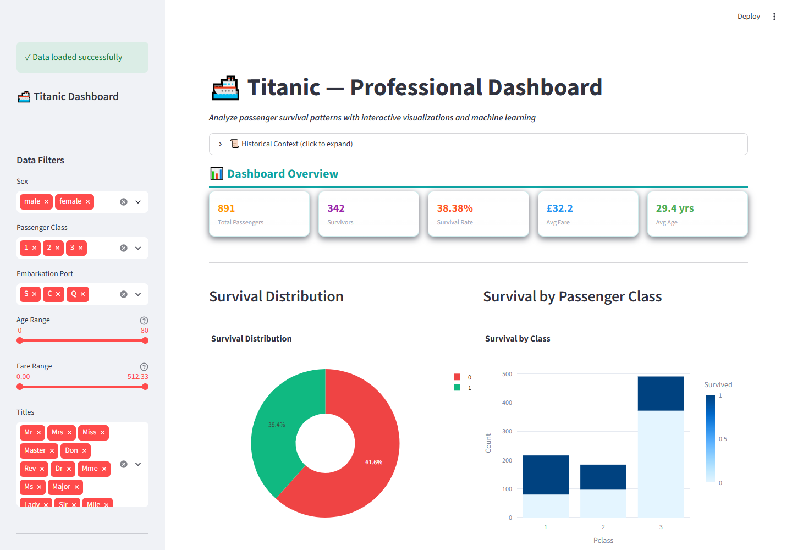
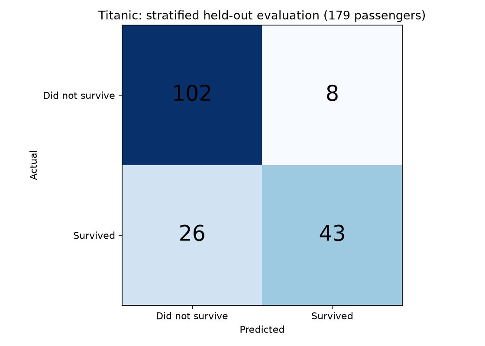

# Titanic Survival Prediction Dashboard

An interactive Streamlit project for exploring Titanic passenger data and
training a Random Forest classifier through a dashboard.

## Features

- Passenger-data exploration with interactive charts and summary metrics.
- Feature engineering for family size, titles, age, fare and cabin availability.
- Random Forest training, evaluation and a survival-prediction interface.
- PDF-report functionality; optional explainability and image-export integrations.

## Run locally

```bash
git clone https://github.com/BrahminPulkit/Titanic-ML-Project.git
cd Titanic-ML-Project
python -m venv .venv
# Activate the virtual environment for your operating system.
python -m pip install -r requirements.txt
python -m streamlit run app.py
```

Paths resolve relative to the repository. The supplied data is in
`titanic/train.csv` and `titanic/test.csv`; the model cache is
`titanic/model_rf.pkl`. Run the application from the cloned project directory.

## Files

| File | Purpose |
| --- | --- |
| `app.py` | Dashboard, preprocessing, training and prediction |
| `titanic/Exploratory Data Analysis(titanic).ipynb` | Exploratory notebook |
| `titanic/train.csv` | Labeled passenger data |
| `titanic/test.csv` | Unlabeled passenger data |

## Evaluation and limitations

This is an educational classification project. Metrics shown by the dashboard
depend on its current split and preprocessing; they are not an independently
validated benchmark. Review preprocessing and evaluation before making model
quality claims. SHAP and Kaleido are optional and are not required for the basic
dashboard. Only load serialized model files from sources you trust.

## Dashboard preview



Actual local dashboard screenshot using the repository's `titanic/train.csv`.

## Reproduce a held-out baseline

```bash
python evaluate.py
```

The script splits the raw data **before fitting preprocessing**, then trains a
Random Forest on 712 records and evaluates on 179 held-out records using a
stratified 80/20 split with `random_state=42`.

| Metric | Result |
| --- | ---: |
| Accuracy | 81.01% |
| F1 score | 0.7167 |
| ROC AUC | 0.8358 |
| Majority-class baseline accuracy | 61.45% |



Raw outputs: [metrics JSON](docs/results/metrics.json) and
[confusion matrix CSV](docs/results/confusion_matrix.csv). The JSON records the
source dataset SHA-256 and scikit-learn version. This is a separate reproducible
baseline, not an evaluation of the dashboard's cached model, a Kaggle score,
K-fold validation or a production-performance claim.
